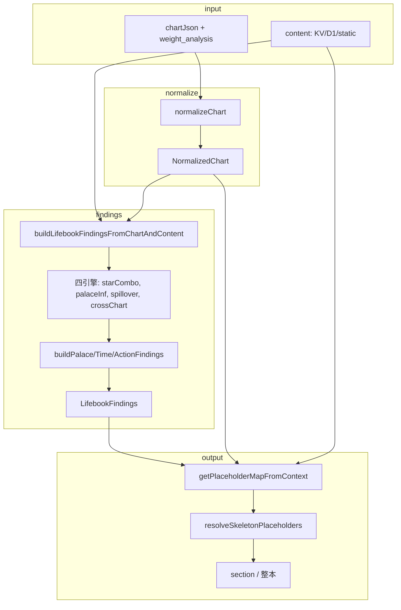

# 全系統盤點報告：bazi-project 系統地圖

> 目標：建立可供重構與升級的「全系統地圖」，涵蓋核心模組、資料流向、演算法、依賴關係、可重用資產與技術負債。

---

## 一、專案概覽與頂層結構

| 區塊 | 路徑 | 用途摘要 |
|------|------|----------|
| **Worker（命書 API）** | `worker/` | Cloudflare Worker：命盤計算、命書章節生成、內容 API、D1/KV |
| **前端** | `src/`, `js/`, `css/`, `public/` | Vite 多入口：main、lifebook-viewer、divination、expert-admin、startup |
| **紫微／命盤** | `ziwei/` | 僅含 `demo-lifebook/index.html`，主計算在 worker 或外部 |
| **靜態內容** | `worker/content/`, `data/` | 命書模板、星曜/宮位語料、CCL3 規則表 |
| **文檔** | `docs/` | 契約、Phase 報告、API 說明、架構 spec |
| **測試** | `worker/tests/`, `tests/`, `e2e/` | Vitest 單元、Playwright E2E |

---

## 二、核心模組與用途

### 2.1 Worker 入口與路由

| 模組 | 檔案 | 用途 |
|------|------|------|
| **單一 fetch 入口** | `worker/src/index.ts` | 路由分派、CORS、content 合併、P2 findings 組裝、命書 API 串接 |
| **命書對外聚合** | `worker/src/lifebook/index.ts` | 匯出 normalizeChart、buildLifebookFindings、Findings 型別、schema、assembler、validators |

**API 路由一覽：**

- `GET /` — 根
- `GET /content/2026` — 內容（locale，優先 KV → D1 → 靜態 JSON）
- `POST /api/log-usage` — 使用記錄
- `POST /compute/all` — 全量計算（命盤＋權重等）
- `POST /compute/horoscope` —  horoscope 計算
- `GET/POST /api/life-book/config` — 命書設定
- `POST /api/life-book/ask` — 問答
- `POST /api/life-book/infer` — 章節推論（insight）
- `POST /api/life-book/narrate` — 敘事潤飾
- `POST /api/life-book/generate-section` — 單章生成
- `POST /api/life-book/generate` — 整本命書批次生成

### 2.2 命盤正規化與資料模型

| 模組 | 檔案 | 用途 |
|------|------|------|
| **NormalizedChart** | `worker/src/lifebook/normalizedChart.ts` | Layer 1 標準命盤型別：宮位、星曜、四化邊、大限、流年 |
| **normalizeChart** | `worker/src/lifebook/normalize/normalizeChart.ts` | chartJson → NormalizedChart（宮名/星名/亮度/四化統一，不做命理判斷） |
| **normalizePalaces** | `worker/src/lifebook/normalize/normalizePalaces.ts` | 建 palaces[]、星曜入宮 |
| **normalizeTransforms** | `worker/src/lifebook/normalize/normalizeTransforms.ts` | 本命/大限/流年四化落宮 |
| **resolveCurrentTimeContext** | `worker/src/lifebook/normalize/resolveCurrentTimeContext.ts` | 當前大限、流年命宮 |
| **宮干飛化** | `worker/src/gonggan-flows.ts` | 宮干 → 四化表 → 本命 flows（TransformEdge[]） |
| **四化天干表** | `worker/src/sihua-stem-table.ts` | 生年天干 → 祿權科忌星 |
| **宮位對照** | `worker/src/palace-map.ts` | 地支→宮位、流年命宮 |

### 2.3 LifebookFindings 與組裝

| 模組 | 檔案 | 用途 |
|------|------|------|
| **LifebookFindings** | `worker/src/lifebook/lifebookFindings.ts` | Layer 4 全書唯一真相：主戰場、壓力出口、外溢、三盤聯動、年度訊號、關鍵年、功課、行動、星曜組合、宮位 pattern、四化落宮/飛化結構化 |
| **buildLifebookFindings** | `worker/src/lifebook/findings/buildLifebookFindings.ts` | 協調器：normalizeChart → 四引擎 → buildPalace/Time/Action → 合併 LifebookFindings；寫入 natalFlowItems |
| **buildPalaceFindings** | `worker/src/lifebook/findings/buildPalaceFindings.ts` | 主戰場、壓力出口、宮位 pattern、星曜組合 |
| **buildTimeFindings** | `worker/src/lifebook/findings/buildTimeFindings.ts` | 時間層、關鍵年、年度訊號 |
| **buildActionFindings** | `worker/src/lifebook/findings/buildActionFindings.ts` | 行動建議、靈魂功課 |
| **findingsSelectors** | `worker/src/lifebook/findings/findingsSelectors.ts` | 排序、挑選、權重（PATTERN_TYPE_WEIGHT, SIGNAL_COLOR_WEIGHT, KEY_YEAR_LABEL_WEIGHT） |
| **findingsRanker / findingsDedupe** | `worker/src/lifebook/findings/` | 排名與去重 |

### 2.4 四引擎（CCL3）

| 引擎 | 路徑 | 輸入 | 輸出 |
|------|------|------|------|
| **星曜組合** | `worker/src/lifebook/engines/starCombination/` | chart.palaces, star-combinations.json | StarCombinationFinding[] |
| **宮位推論** | `worker/src/lifebook/engines/palaceInference/` | palaces, palace-transform-star-matrix, main-star-inference-hints | PalacePatternFinding[] |
| **壓力外溢** | `worker/src/lifebook/engines/crossChart/spilloverEngine.ts` | chart, crossChartRules, palaceAxisLinks | SpilloverFinding[] |
| **三盤聯動** | `worker/src/lifebook/engines/crossChart/crossChartEngine.ts` | chart, palacePatterns, spillovers, starCombinations | CrossChartFinding[], yearSignals, lifeLessons |

### 2.5 章節組裝與模板

| 模組 | 檔案 | 用途 |
|------|------|------|
| **lifeBookPrompts** | `worker/src/lifeBookPrompts.ts` | 骨架 placeholder、getPlaceholderMapFromContext、getPalaceSectionReaderOverrides、buildPalaceContext、buildSanFangAnalysis、buildStarCombinationAnalysis、四化/飛化 builder（供 s00/s03/模組二）、resolveSkeletonPlaceholders、getSectionTechnicalBlocks |
| **lifeBookTemplates** | `worker/src/lifeBookTemplates.ts` | SECTION_TEMPLATES、slice 類型、宮位對應 |
| **assembleS15/S18/S20** | `worker/src/lifebook/assemblers/` | 時間主線、盲點、三盤疊加等章節從 findings 組裝 |
| **assembleTimeModuleFromFindings** | `worker/src/lifebook/findings/assembleTimeModuleFromFindings.ts` | 時間軸 placeholder 從 findings 填值 |
| **narrativeFacade** | `worker/src/lifebook/narrativeFacade.ts` | 星曜/宮位語意查詢（getStarSemantic, getPalaceSemantic 等） |
| **starNarrativeForPalace** | `worker/src/lifebook/starNarrativeForPalace.ts` | 單宮星曜敘事（buildPalaceStarNarrativeBlock） |

### 2.6 四化／飛化專用

| 模組 | 檔案 | 用途 |
|------|------|------|
| **buildTransformFlowLines** | `worker/src/lifebook/transforms/buildTransformFlowLines.ts` | getFlowBlockForPalace、本命宮干飛化區塊字串 |
| **s00 管道** | `worker/src/lifebook/s00Pipeline.ts`, `s00Normalizer.ts`, `s00DetectorsV2.js` | s00 四化事件正規化與敘事 |
| **sihuaFlowEngine** | `worker/src/lifebook/sihuaFlowEngine.ts` | 四化流向 Top flows、敘事句庫 |
| **getSihuaPlacementItemsFromChart** | `worker/src/lifeBookPrompts.ts` | chart → SihuaPlacementItem[]（供 findings.sihuaPlacementItems） |

### 2.7 診斷與敘事引擎

| 模組 | 檔案 | 用途 |
|------|------|------|
| **diagnosticEngine** | `worker/src/lifebook/diagnosticEngine.ts` | 穿透式診斷聚合（tensionEngine, rootCauseEngine, reframingEngine） |
| **tensionEngine / rootCauseEngine / reframingEngine** | `worker/src/lifebook/` | 張力、根因、重構敘事 |
| **transformInterpretationEngine** | `worker/src/lifebook/transformInterpretationEngine.ts` | 四化解讀 |
| **destinyBodyDialogue, bodyPalaceAlignment, s04StrategyIntegrated** | `worker/src/lifebook/` | 命身、策略整合 |

### 2.8 獨立四化引擎（s00 模組一）

| 模組 | 檔案 | 用途 |
|------|------|------|
| **normalizeSiHuaEvents** | `worker/src/engine/normalizeSiHuaEvents.ts` | 四化事件正規化 |
| **patternDetectors** | `worker/src/engine/patternDetectors.ts` | R01/R02/R11/R30 等規則 |
| **patternMerge** | `worker/src/engine/patternMerge.ts` | 合併 pattern hits |
| **generateNarrative** | `worker/src/engine/generateNarrative.ts` | 敘事生成 |
| **decisionEngine** | `worker/src/engine/decisionEngine.ts` | 決策建議 |

### 2.9 內容與配置

| 來源 | 路徑 | 用途 |
|------|------|------|
| **命書章節骨架** | `worker/content/lifebookSection-zh-TW.json` | 12 宮、s00/s03/s04/s15… structure_analysis 等 |
| **星曜語料** | `worker/content/starPalacesMain-zh-TW.json`, `starBaseCore-zh-TW.json`, `starMetadata.json` 等 | 星曜在宮位表現、亮度、語意 |
| **宮位語境** | `worker/content/palaceContexts-zh-TW.json`, `palaceRiskCorpus-zh-TW.json` | 宮位核心、風險語料 |
| **CCL3 表** | `worker/content/ccl3/*.json` | star-combinations, cross-chart-rules, palace-axis-links, patterns, risk-signals 等 |
| **D1 + KV** | `worker/src/content-from-d1.js`, index 內 getContentForLocale | 內容優先級：KV (`content:${locale}:v2`) > D1 > 靜態 |

---

## 三、資料來源、資料模型、資料流向

### 3.1 資料來源

```json
{
  "data_sources": {
    "chart_input": "POST body (chart_json, weight_analysis, locale)；可能來自前端 exportCalculationResults() 或含 features.ziwei 的 compute 回傳",
    "content_static": "worker/content/*.json（lifebookSection, content-zh-TW, ccl3, starPalacesMain 等）",
    "content_db": "D1 ui_copy_texts（mergeContent 時 static 覆寫 D1 的 lifebookSection）",
    "content_cache": "KV key content:${locale}:v2"
  }
}
```

### 3.2 核心資料模型（結構化摘要）

```json
{
  "models": {
    "NormalizedChart": {
      "file": "worker/src/lifebook/normalizedChart.ts",
      "key_fields": ["chartId", "locale", "nominalAge", "flowYear", "mingGong", "shenGong", "palaces[]", "natal", "decadalLimits", "currentDecade", "yearlyHoroscope"],
      "nested": ["PalaceStructure", "TransformEdge", "StarInPalace", "DecadalLimit", "NatalScope", "YearScope"]
    },
    "LifebookFindings": {
      "file": "worker/src/lifebook/lifebookFindings.ts",
      "key_arrays": ["mainBattlefields", "pressureOutlets", "spilloverFindings", "crossChartFindings", "yearSignals", "keyYears", "lifeLessons", "actionItems", "starCombinations", "palacePatterns", "sihuaPlacementItems", "natalFlowItems"],
      "precomputed_strings": ["timelineSummary", "sihuaPlacement", "sihuaEnergy", "natalFlows", "timeAxis"]
    },
    "PalaceStructure": {
      "key_fields": ["palace", "mainStars", "assistantStars", "shaStars", "miscStars", "natalTransformsIn/Out", "decadalTransformsIn/Out", "yearlyTransformsIn/Out"]
    },
    "TransformEdge": {
      "key_fields": ["fromPalace", "toPalace", "transform", "layer", "starName"]
    }
  }
}
```

### 3.3 資料流向（高階）

```
chartJson (raw)
  → normalizeChart() → NormalizedChart
  → buildLifebookFindingsFromChartAndContent({ chartJson, content: P2_CONTENT })
      → buildLifebookFindings(input)
          → runStarCombinationEngine, runPalaceInferenceEngine, buildSpilloverFindings, buildCrossChartEngineResult
          → buildPalaceFindings, buildTimeFindings, buildActionFindings
          → 合併 + natalFlowItems 從 chart.natal.flows 寫入
  → LifebookFindings (+ timeContext)

index.ts 另寫：result.findings.sihuaPlacementItems = getSihuaPlacementItemsFromChart(chartJson)

12 宮正文：getPalaceSectionReaderOverrides(sectionKey, chart, config, content, findings)
  → buildPalaceContext → getPlaceholderMapFromContext(ctx, { chartJson, sectionKey, content, findings })
  → resolveSkeletonPlaceholders(sectionSkeleton.structure_analysis, placeholderMap)
  → resolvedStructureAnalysis（必要時 index 內強制覆寫 section.structure_analysis）
```

---

## 四、演算法、規則引擎、評分邏輯

### 4.1 命盤與四化

| 項目 | 位置 | 說明 |
|------|------|------|
| 宮位順序與三方四正 | `lifeBookPrompts.ts`（PALACE_RING_ZH, getSanfangSizheng） | 12 宮索引、(idx+4)%12,(idx+8)%12,(idx+6)%12 為三合與對宮 |
| 宮干飛化 | `gonggan-flows.ts` | 宮干 → SI_HUA_BY_STEM → 星名 → findPalaceByStar → from/to 邊 |
| 四化落宮 | `normalizeTransforms.ts`, `getSihuaPlacementItemsFromChart` | 本命/大限/流年 祿權科忌落宮 |
| 生年四化表 | `sihua-stem-table.ts` | 天干 → 祿權科忌星 |

### 4.2 評分與權重

| 項目 | 位置 | 說明 |
|------|------|------|
| 主戰場選宮 | `findingsSelectors.ts` (selectMainBattlefields) | currentDecade +3、流年命宮 +2、pattern shock≥2 +2、spillover to +2、starCombo +1、crossChart +2 |
| PATTERN_TYPE_WEIGHT | findingsSelectors.ts | pressure:4, power:3, correction:2, growth:1 |
| SIGNAL_COLOR_WEIGHT | findingsSelectors.ts | red:3, yellow:2, green:1 |
| KEY_YEAR_LABEL_WEIGHT | findingsSelectors.ts | mine:3, shock:2, opportunity:1 |
| shockLevel | 各 Finding 型別 | 用於排序與篩選 |

### 4.3 規則引擎

| 引擎 | 規則來源 | 行為 |
|------|----------|------|
| crossChartRuleMatcher | cross-chart-rules.json | trigger(transform+from+to) 比對 → diagnosis, lifePattern, advice |
| palacePatternMatcher | palace-transform-star-matrix.json | 主星+四化 → patternType, psychology, lifePattern |
| starCombinationMatcher | star-combinations.json | 宮內兩星排序後比對 → StarCombinationFinding |
| spilloverEngine | crossChartRules + palaceAxisLinks | 軸線與規則 → SpilloverFinding |

---

## 五、紫微／命盤／宮位／星曜／四化／飛星／大限／流年 相關程式與資料

### 5.1 程式（清單）

- **正規化與命盤結構**：`normalizeChart.ts`, `normalizePalaces.ts`, `normalizeTransforms.ts`, `resolveCurrentTimeContext.ts`, `normalizedChart.ts`, `palace-map.ts`, `canonicalKeys.ts`
- **宮位**：`schema.ts` (PALACES, PalaceId), `getSanfangSizheng`, `getOppositePalaceName`, `toPalaceCanonical`, `palaceContexts`, `buildPalaceContextThreeLines`, `PALACE_CONTEXT_THREE_LINES`
- **星曜**：`schema.ts` (STARS, MainStarId), `star-registry.json`, `starPalacesMain/starPalacesAux`, `narrativeFacade`, `starNarrativeForPalace`, `leadMainStarResolver`, `getMasterStarsFromZiwei`
- **四化**：`sihua-stem-table.ts`, `normalizeTransforms.ts`, `getSihuaPlacementItemsFromChart`, `buildSiHuaLayers`, `buildSihuaPlacementBlock`, `LAYER_LABEL`
- **飛星／宮干飛化**：`gonggan-flows.ts`, `buildTransformFlowLines.ts`, `getFlowBlockForPalace`, `buildSihuaFlowBlock`, `natalFlowItems`, `NatalFlowItem`
- **大限**：`decadalLimits`, `currentDecade`, `resolveCurrentDecade`, `decadalPalaceThemes.json`, `DECADAL_THEME_BY_PALACE`
- **流年**：`yearlyHoroscope`, `resolveYearlyHoroscope`, `flowYear`, `destinyPalace`, `liunian`

### 5.2 資料（清單）

- **宮位**：`palaceContexts-zh-TW.json`, `palaceRiskCorpus-zh-TW.json`, `ccl3/palace-axis-links.json`, `ccl3/palace-tags.json`, `tenGodPalacesById-zh-TW.json`, `decadalPalaceThemes.json`
- **星曜**：`star-registry.json`, `starMetadata.json`, `starPalacesMain-zh-TW.json`, `starBaseCore/Shadow/Meaning`, `ccl3/star-combinations.json`, `ccl3/star-tags.json`, `ccl3/star-psychology.json`, `ccl3/star-stress-patterns.json`, `ccl3/star-life-lessons.json`
- **四化／飛化**：`sihua-stem-table.ts`（SI_HUA_BY_STEM）, `transformIntoPalaceMeanings.json`, `ccl3/cross-chart-rules.json`（trigger 含四化）

---

## 六、模組間依賴關係、呼叫鏈、流程圖

### 6.1 依賴關係（高階）

```
index.ts
  ← lifeBookPrompts (getPalaceSectionReaderOverrides, getSectionTechnicalBlocks, getSihuaPlacementItemsFromChart, buildP2FindingsAndContext 使用 findings)
  ← lifebook/index (normalizeChart, buildLifebookFindingsFromChartAndContent, createEmptyFindings)
  ← lifeBookTemplates (SECTION_TEMPLATES)
  ← lifeBookInfer, lifeBookNarrate
  ← content-from-d1, 靜態 JSON

lifebook/index.ts
  ← normalize/index (normalizeChart)
  ← findings/buildLifebookFindings (buildLifebookFindingsFromChartAndContent, buildLifebookFindings)
  ← lifebookFindings (型別, createEmptyFindings)
  ← validators/validateTimelineConsistency
  ← engines (starCombination, palaceInference, crossChart spillover/crossChartEngine)
  ← findings (buildPalaceFindings, buildTimeFindings, buildActionFindings)

buildLifebookFindings
  ← normalizeChart (已在 buildInputFromChartAndContent 內)
  ← runStarCombinationEngine, runPalaceInferenceEngine, buildSpilloverFindings, buildCrossChartEngineResult
  ← buildPalaceFindings, buildTimeFindings, buildActionFindings
  → 寫入 f.natalFlowItems 從 chart.natal.flows
```

### 6.2 命書單章／批次流程（簡化）

```
POST /api/life-book/generate-section 或 /generate
  → chart 正規化 (chartForSection / chartForGenerate)
  → getContentForLocale(env, locale)  // KV → D1 → static
  → buildP2FindingsAndContext(chart)
      → buildLifebookFindingsFromChartAndContent({ chartJson, content: P2_CONTENT })
      → result.findings.sihuaPlacementItems = getSihuaPlacementItemsFromChart(chartJson)
  → (12 宮) findingsForPalace = p2.findings ?? createEmptyFindings(); 水合 natalFlowItems 若空
  → getPalaceSectionReaderOverrides(sectionKey, chart, config, content, findingsForPalace)
      → buildPalaceContext → getPlaceholderMapFromContext(ctx, { chartJson, sectionKey, content, findings })
      → resolveSkeletonPlaceholders(skeleton.structure_analysis, placeholderMap)
  → 強制 structure_analysis = overrides.resolvedStructureAnalysis（12 宮防呆）
  → 回傳 section
```

### 6.3 流程圖（Mermaid）



---

## 七、各模組輸入輸出格式（摘要）

| 模組 | 輸入 | 輸出 |
|------|------|------|
| normalizeChart | `Record<string, unknown>` (chartJson) | `NormalizedChart` |
| buildLifebookFindingsFromChartAndContent | `{ chartJson, content: LifebookContentLookup }` | `{ findings, timeContext, timelineValidationIssues } \| null` |
| getPlaceholderMapFromContext | `ctx: PalaceContext`, `opts: { chartJson, sectionKey, content, findings, … }` | `Record<string, string>` (placeholder map) |
| getPalaceSectionReaderOverrides | sectionKey, chartJson, config, content, findings | `{ resolvedStructureAnalysis?, starBlockToAppend, behavior_pattern, blind_spots, strategic_advice } \| null` |
| resolveSkeletonPlaceholders | text, map, options | string（替換 {key}） |
| buildSanFangAnalysis | currentPalace: string | string |
| buildStarCombinationAnalysis | palaceName, findings | string |
| getFlowBlockForPalace | chart: NormalizedChart, palaceName | string（本命宮干飛化區塊） |

---

## 八、可重用資產與技術負債

### 8.1 可重用資產

- **NormalizedChart + normalizeChart**：單一標準命盤格式，適合作為新系統的「命盤介面」。
- **LifebookFindings**：已收斂的章節用結構化結果，可被新 UI 或新敘事引擎直接消費。
- **CCL3 表**：star-combinations、cross-chart-rules、palace-axis-links、patterns 等，規則驅動、易擴充。
- **findingsSelectors + 權重常數**：主戰場/壓力/關鍵年等選宮邏輯可抽成獨立服務或函式庫。
- **narrativeFacade + 語料**：星曜/宮位語意查詢與靜態語料，可保留為「語意層」。
- **宮位／星曜 schema**：PALACES, STARS, PalaceId, MainStarId 等，可作為共用 ontology。

### 8.2 技術負債

- **lifeBookPrompts.ts 過大**：單檔承載大量 builder、placeholder、getPlaceholderMapFromContext、Phase 5B debug，建議拆成「12 宮 builders」「s00/s03 builders」「placeholder 綁定」等模組。
- **重複／殘留**：buildSihuaEdges 重複宣告、部分舊 placeholder（如 palaceSihuaSummaryBlock）僅部分路徑使用；s00/s03 與 12 宮混用不同資料路徑（chart 直讀 vs findings）。
- **型別與測試**：專案內存在多處既有 TS 錯誤（DbContent、WeightAnalysis、crossChart、s00PatternEngine、starGroupNarrative 等），需集中修復；測試覆蓋以 worker 為主，前端與整合鏈路較少。
- **內容多源**：KV / D1 / 靜態 JSON 三層，除錯與版本控管需依賴 key 版本（如 content:v2）與文檔說明。
- **四化引擎雙軌**：engine/ 下 normalizeSiHuaEvents + patternDetectors 與 lifebook 下 s00Pipeline/buildLifebookFindings 並存，長期可收斂為單一管道。

---

## 九、適合保留 vs 適合取代／包裝

### 9.1 建議保留

- **normalizeChart + NormalizedChart**：作為命盤標準介面。
- **LifebookFindings 結構與 buildLifebookFindings 流程**：章節只讀 findings 的架構。
- **CCL3 表與四引擎**：規則驅動、易維護與擴充。
- **findingsSelectors 與權重**：主戰場/關鍵年等邏輯穩定。
- **narrativeFacade + 語料 JSON**：語意層與語料分離。
- **getContentForLocale + 版本化 cache key**：內容分層與快取策略。

### 9.2 建議重構或收斂

- **lifeBookPrompts**：拆檔、抽出 12 宮/s00/s03 專用 builder 與 placeholder 綁定。
- **四化／飛化雙路**：s00 模組一與 lifebook findings 管道收斂為單一來源（例如 s00 改讀 findings 或共用同一正規化與寫入點）。
- **chart 直讀殘留**：模組二、技術版在「無 findings」時仍直讀 chart；可統一為「先水合 findings 再組裝」，減少分支。

### 9.3 可被新系統取代或包裝

- **單章/批次 API 的「AI 回傳 + override」合併邏輯**：若新系統改為「純資料驅動」或「模板 + findings  only」，可改為只走 resolvedStructureAnalysis，不再依賴 AI 四欄位。
- **舊 s00 敘事格式**：若新產品改版 s00 呈現方式，可保留 engine 輸出結構，僅替換敘事模板與前端。
- **D1 內容表結構**：若改為 Headless CMS 或別種內容來源，可保留 getContentForLocale 介面，替換底層實作。

---

## 十、結構化 JSON 摘要

以下為可被工具或後續文件引用的結構化摘要。

```json
{
  "system_audit": {
    "version": "1.0",
    "project": "bazi-project",
    "audit_focus": ["worker", "lifebook", "content", "docs"],
    "entry_points": {
      "worker": "worker/src/index.ts",
      "lifebook_facade": "worker/src/lifebook/index.ts",
      "findings_orchestrator": "worker/src/lifebook/findings/buildLifebookFindings.ts"
    },
    "data_flow": [
      "chartJson -> normalizeChart -> NormalizedChart",
      "NormalizedChart + P2_CONTENT -> buildLifebookFindingsFromChartAndContent -> LifebookFindings",
      "LifebookFindings + section skeleton -> getPlaceholderMapFromContext -> resolveSkeletonPlaceholders -> section text"
    ],
    "core_models": [
      "NormalizedChart (normalizedChart.ts)",
      "LifebookFindings (lifebookFindings.ts)",
      "PalaceStructure, TransformEdge, StarInPalace (normalizedChart.ts)",
      "StarCombinationFinding, PalacePatternFinding, SpilloverFinding, CrossChartFinding (lifebookFindings.ts)"
    ],
    "engines": [
      "starCombinationEngine",
      "palaceInferenceEngine",
      "spilloverEngine",
      "crossChartEngine"
    ],
    "content_sources": ["worker/content/*.json", "D1 ui_copy_texts", "KV content:${locale}:v2"],
    "api_routes": [
      "GET /content/2026",
      "POST /compute/all",
      "POST /api/life-book/generate-section",
      "POST /api/life-book/generate"
    ],
    "reusable_assets": [
      "normalizeChart + NormalizedChart",
      "LifebookFindings + buildLifebookFindings",
      "CCL3 tables",
      "findingsSelectors + weights",
      "narrativeFacade + corpus"
    ],
    "tech_debt": [
      "lifeBookPrompts.ts size and duplication",
      "Dual sihua paths (engine/ vs lifebook)",
      "Existing TS errors across codebase",
      "Content multi-source debugging"
    ]
  }
}
```

---

## 十一、文件與規格索引

| 文件 | 用途 |
|------|------|
| `docs/lifebook-engine-architecture-spec-v1.1.md` | Layer 1–6、正規化、Findings、章節只讀原則 |
| `docs/lifebook-data-contract.md` | 資料契約 |
| `docs/lifebook-assembly-contract.md` | 組裝契約 |
| `docs/lifebook-algorithm-contract.md` | 演算法契約 |
| `docs/lifebook-technical-debt-and-data-normalization-audit.md` | 技術負債與正規化審計 |
| `docs/lifebook-narrative-canonical-sources.md` | 敘事與語料來源 |
| Phase 5B-* 報告 | 四化/飛化、骨架、hydration、reader path 診斷與修復 |

---

*本報告為靜態盤點，未改動任何程式碼；可依重構計畫再細化單一模組或單一資料流。*
